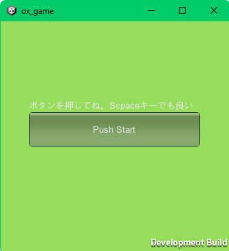
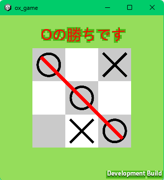

# OXゲーム(オンライン対戦可)

## ルール
通常の三目並べと同様  

△注意△  
マッチングが完了するまでOXを置かないでください。途中入退室に対応していません。

## 仕様
- GUI  
    - ボード(3x3)  
    - 石(ox)
- 通信  
    - 交代  
    = 相手の番の時は動けない
    - 相手の処理の反映  
- 勝利条件  
    - 縦横斜め三つ揃えば勝ち

- プラットフォーム  
    - PC(Windows)